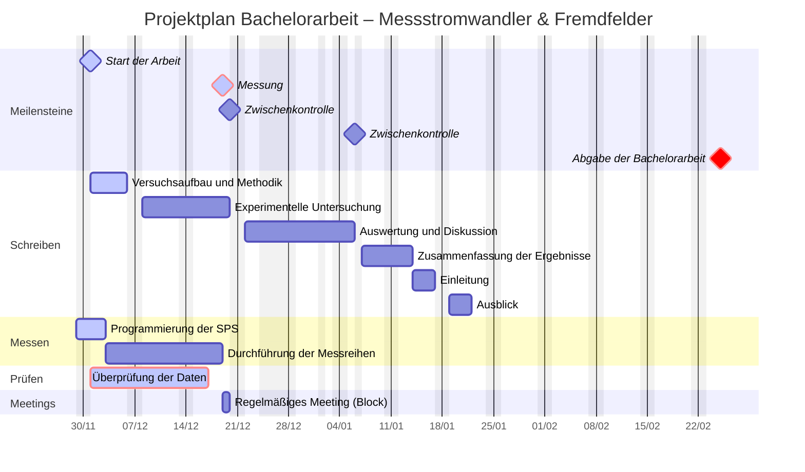

# Bachelorarbeit: Fremdfeldbeeinflussung auf Messstromwandler in der Niederspannung

## Projektübersicht

Diese Bachelorarbeit befasst sich mit der Analyse von Messfehlern bei Stromwandlern, die in Niederspannungsschaltanlagen eingesetzt werden. Der Schwerpunkt der Untersuchung liegt auf der magnetischen Kopplung zwischen Stromwandlern benachbarter Phasen, welche als eine wesentliche Ursache für Messabweichungen identifiziert wurde.

## Ziele

- **Theoretische Analyse:** Erarbeitung der physikalischen Grundlagen der magnetischen Feldkopplung und deren Auswirkungen auf Messstromwandler.
- **Experimentelle Untersuchung:** Durchführung von Messreihen an einem praxisnahen Versuchsaufbau zur Quantifizierung der Fremdfeldbeeinflussung.
- **Datenanalyse und Validierung:** Vergleich der gewonnenen Messdaten mit den theoretisch ermittelten Modellen zur Validierung der Hypothesen.
- **Entwicklung von Lösungsansätzen:** Ausarbeitung von konkreten Handlungsempfehlungen und technischen Maßnahmen zur Minimierung der festgestellten Messfehler.

# Zeitplan Bachelorarbeit

Hier ist der aktuelle Stand der Planung.

# Projektplan



# Autor

Oliver Schmidt

Lizenz

Dieses Projekt ist unter der MIT License lizenziert. Weitere Details finden sich in der LICENSE.md-Datei.

```

```
